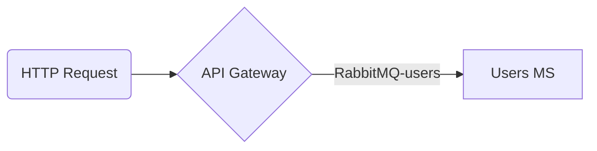

# Microservice POC built using Nest and Docker Compose to up and manage all services.

## Getting started (dev mode)



```
docker-compose up
```

## KIBANA

```
http://localhost:5601
```

## ELASTIC

```
http://localhost:9200
```

## RABBITMQ (GUEST/GUEST)

```
http://localhost:15672
```

## Test the API

```
curl http://localhost:8080/users/:github-username
```
