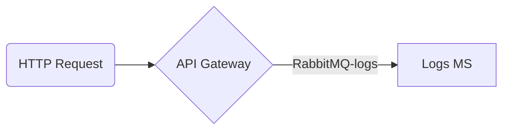

# Microservice POC built using Nest and Docker Compose to up and manage all services.

## Technologies

- [Nest.js](https://nestjs.com/)
- [RabbitMQ](https://www.rabbitmq.com/)
- [Elasticsearch](https://www.elastic.co/)
- [Kibana](https://www.elastic.co/kibana/)

<p align="left"> <a href="https://www.docker.com/" target="_blank" rel="noreferrer">  </a> <a href="https://www.elastic.co" target="_blank" rel="noreferrer">  </a> <a href="https://www.elastic.co/kibana" target="_blank" rel="noreferrer">  </a> <a href="https://nestjs.com/" target="_blank" rel="noreferrer">  </a> <a href="https://www.rabbitmq.com" target="_blank" rel="noreferrer">  </a> <a href="https://www.typescriptlang.org/" target="_blank" rel="noreferrer">  </a> </p>



## Getting started (dev mode)

```
docker-compose up
```

## KIBANA

```
http://localhost:5601
```

## ELASTIC

```
http://localhost:9200
```

## RABBITMQ (GUEST/GUEST)

```
http://localhost:15672
```

## Test the API

```
curl http://localhost:8080/users/:github-username
```
